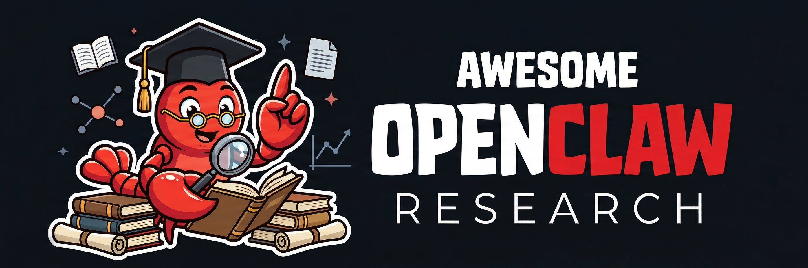
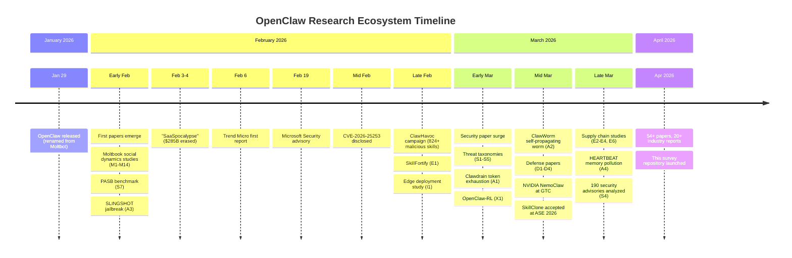

# Awesome OpenClaw Research [](https://awesome.re)

<p align="center">
  
</p>

<p align="center">
  <b>A curated collection of academic papers, security reports, datasets, and tools for the OpenClaw AI agent ecosystem.</b>
  <br/>
  <i>Companion resource for our survey paper.</i>
</p>

<p align="center">
  
  
  
  
  
</p>

OpenClaw — the open-source, self-hosted AI agent platform created by Peter Steinberger (evolving from Clawdbot → Moltbot → OpenClaw on January 29, 2026) — has generated **54+ academic papers** and **20+ major industry reports** in under three months. This repository systematically catalogs the research landscape using a six-layer architecture-aligned taxonomy.

---

## Statistics at a Glance

| Layer | Category | Papers | Key Topics |
|:-----:|:---------|:------:|:-----------|
| L1 | Core Platform & Architecture | 6 | RL training, robotics, P2P, edge deployment |
| L2 | Skill Ecosystem & Supply Chain | 6 | Formal analysis, clone detection, auditing |
| L3 | Security & Trust | 16 | Threat taxonomies, attacks, defenses |
| L4 | Agent Social Dynamics (Moltbook) | 18 | Network structure, safety decay, coordination |
| L5 | Applications & Domains | 4 | Healthcare, finance, education, robotics |
| L6 | Ecosystem Perspectives | 4 | Surveys, position papers, strategy |
| | **Total** | **54** | |

### Research Timeline



---

## Contents

- [Research Papers](#research-papers)
  - [1. Core Platform & Architecture](#1-core-platform--architecture)
  - [2. Skill Ecosystem & Supply Chain](#2-skill-ecosystem--supply-chain)
  - [3. Security & Trust](#3-security--trust)
    - [3.1 Threat Analysis & Taxonomies](#31-threat-analysis--taxonomies)
    - [3.2 Adversarial Attacks](#32-adversarial-attacks)
    - [3.3 Defensive Architectures](#33-defensive-architectures)
  - [4. Agent Social Dynamics (Moltbook)](#4-agent-social-dynamics-moltbook)
    - [4.1 Platform Measurement & Network Structure](#41-platform-measurement--network-structure)
    - [4.2 Safety, Norms & Emergent Behavior](#42-safety-norms--emergent-behavior)
    - [4.3 Learning & Coordination](#43-learning--coordination)
  - [5. Applications & Domains](#5-applications--domains)
  - [6. Ecosystem Perspectives](#6-ecosystem-perspectives)
- [Industry Security Reports](#industry-security-reports)
- [Open-Source Projects & Tools](#open-source-projects--tools)
- [Datasets & Benchmarks](#datasets--benchmarks)
- [Related Awesome Lists](#related-awesome-lists)
- [Contributing](#contributing)

---

## Research Papers

### 1. Core Platform & Architecture

Papers that extend or modify the OpenClaw framework itself — new training paradigms, integration layers, deployment models.

- **OpenClaw-RL: Train Any Agent Simply by Talking** - Yinjie Wang, Xuyang Chen, Xiaolong Jin, Mengdi Wang, Ling Yang. arXiv, Mar 2026.
  [[Paper](https://arxiv.org/abs/2603.10165)] [[Code](https://github.com/Gen-Verse/OpenClaw-RL) ]
  > Fully asynchronous RL framework recovering next-state signals from live interaction; introduces Hindsight-Guided On-Policy Distillation (OPD).

- **ROSClaw: An OpenClaw ROS 2 Framework for Agentic Robot Control and Interaction** - Irvin Steve Cardenas, Marcus Anthony Arnett, Natalie Catherine Yeo, Lucky Shah, Jong-Hoon Kim. arXiv, Mar 2026.
  [[Paper](https://arxiv.org/abs/2603.26997)]
  > Model-agnostic executive layer integrating OpenClaw with ROS 2; deployed on three robot platforms with up to 4.8x differences in out-of-policy action rates.

- **RoboClaw: An Agentic Framework for Scalable Long-Horizon Robotic Tasks** - Ruiying Li et al. (18 authors; AgiBot, Shanghai Jiao Tong University, NUS). arXiv, Mar 2026.
  [[Paper](https://arxiv.org/abs/2603.11558)] [[Code](https://github.com/MINT-SJTU/RoboClaw) ]
  > VLM-driven controller built on OpenClaw with Entangled Action Pairs (EAP) for self-resetting data collection; 25% success rate improvement on long-horizon tasks, 53.7% reduction in human time investment.

- **From Agent-Only Social Networks to Autonomous Scientific Research: Lessons from OpenClaw and Moltbook** - Lukas Weidener, Marko Brkic, Phillip Lee, Martin Karlsson, Kevin Noessler, Paul Kohlhaas. arXiv, Feb 2026.
  [[Paper](https://arxiv.org/abs/2602.19810)]
  > Multivocal literature review + design science; presents ClawdLab for autonomous scientific research with PI-led governance.

- **OpenCLAW-P2P: A Decentralized Framework for Collective AI Intelligence Towards AGI** - Goodman, Al-Mayahi, Guillermo Perry (Incline Enterprising Inc.). ResearchGate, 2026.
  [[Paper](https://www.researchgate.net/publication/401449080)]
  > Decentralized P2P framework on Kademlia DHT with federated learning, BFT voting, and Lean 4 formal verification.

- **Systems-Level Attack Surface of Edge Agent Deployments on IoT** - Zhonghao Zhan, Krinos Li, Yefan Zhang, Hamed Haddadi (Imperial College London, ByteDance). arXiv, Feb 2026.
  [[Paper](https://arxiv.org/abs/2602.22525)]
  > Empirical security comparison of cloud, edge-local, and hybrid agent architectures; identifies 40,000+ exposed OpenClaw gateways and concludes deployment architecture is the primary security determinant.

### 2. Skill Ecosystem & Supply Chain

Papers investigating the ClawHub marketplace, skill security, and broader ecosystem challenges.

- **Formal Analysis and Supply Chain Security for Agentic AI Skills (SkillFortify)** - Varun Pratap Bhardwaj. arXiv, Feb 2026.
  [[Paper](https://arxiv.org/abs/2603.00195)]
  > First formal analysis framework: DY-Skill attacker model, capability-based sandboxing, trust score algebra; 96.95% F1 on SkillFortifyBench (540 skills).

- **SkillProbe: Security Auditing for Emerging Agent Skill Marketplaces via Multi-Agent Collaboration** - Multiple authors. arXiv, Mar 2026.
  [[Paper](https://arxiv.org/abs/2603.21019)]
  > "Skills-for-Skills" auditing paradigm; longitudinal audit of 2,500 ClawHub skills finds 90%+ of high-popularity skills fail rigorous auditing.

- **SkillClone: Multi-Modal Clone Detection and Clone Propagation Analysis in the Agent Skill Ecosystem** - Multiple authors. arXiv, Mar 2026. **Accepted at ASE 2026.**
  [[Paper](https://arxiv.org/abs/2603.22447)]
  > First multi-modal clone detection (F1=0.939); 258,000 clone pairs across 20,000 skills; ecosystem inflated 3.5x. First peer-reviewed venue paper in the OpenClaw literature.

- **Malicious Or Not: Adding Repository Context to Agent Skill Classification** - Florian Holzbauer, David Schmidt, Gabriel Gegenhuber, Sebastian Schrittwieser, Johanna Ullrich (IT:U Linz, University of Vienna). arXiv, Mar 2026.
  [[Paper](https://arxiv.org/abs/2603.16572)]
  > Largest empirical analysis: 238,180 unique skills from ClawHub, Skills.sh, SkillsDirectory, and GitHub; repository-context reduces false positive rate to 0.52%.

- **SkillNet: Create, Evaluate, and Connect AI Skills** - Yuan Liang et al. (49 authors; Zhejiang University, Alibaba, Ant Group, Tencent, OPPO). arXiv, Feb 2026.
  [[Paper](https://arxiv.org/abs/2603.04448)]
  > Open infrastructure with unified ontology and multi-dimensional evaluation; repository of 200,000+ skills.

- **SkillReducer: Optimizing LLM Agent Skills for Token Efficiency** - Multiple authors. arXiv, Mar 2026.
  [[Paper](https://arxiv.org/abs/2603.29919)]
  > Studies 55,315 public skills; finds 26.4% lack routing descriptions and 60%+ of body content is non-actionable; proposes two-stage optimization.

### 3. Security & Trust

The largest research cluster (15 papers), examining OpenClaw's attack surface from threat analysis through novel attacks to defensive systems.

#### 3.1 Threat Analysis & Taxonomies

- **Uncovering Security Threats and Architecting Defenses in Autonomous Agents: A Case Study of OpenClaw** - Zonghao Ying, Xiao Yang, Siyang Wu et al. arXiv, Mar 2026.
  [[Paper](https://arxiv.org/abs/2603.12644)]
  > Tri-layered risk taxonomy (AI Cognitive, Software Execution, Information System); introduces FASA architecture and ClawGuard platform.

- **Don't Let the Claw Grip Your Hand: A Security Analysis and Defense Framework for OpenClaw** - Zhengyang Shan, Jiayun Xin, Yue Zhang, Minghui Xu. arXiv, Mar 2026.
  [[Paper](https://arxiv.org/abs/2603.10387)]
  > 47 adversarial scenarios across six MITRE ATT&CK categories; OpenClaw achieves only 17% defense rate; HITL defense boosts to 19-92%.

- **Taming OpenClaw: Security Analysis and Mitigation of Autonomous LLM Agent Threats** - Xinhao Deng et al. (18 authors; Tsinghua University, Ant Group). arXiv, Mar 2026.
  [[Paper](https://arxiv.org/abs/2603.11619)]
  > Five-layer lifecycle-oriented security framework covering initialization through execution; examines compound threats.

- **A Systematic Taxonomy of Security Vulnerabilities in the OpenClaw AI Agent Framework** - Surada Suwansathit, Yuxuan Zhang, Guofei Gu (SUCCESS Lab, Texas A&M). arXiv, Mar 2026.
  [[Paper](https://arxiv.org/abs/2603.27517)]
  > Analyzes 190 security advisories; introduces OpenClaw-specific kill chain adapting MITRE ATT&CK with novel "Context Manipulation" stage.

- **Defensible Design for OpenClaw: Securing Autonomous Tool-Invoking Agents** - Zongwei Li, Wenkai Li, Xiaoqi Li (Hainan University). arXiv, Mar 2026.
  [[Paper](https://arxiv.org/abs/2603.13151)]
  > Four risk classes, pipeline-oriented threat model, four engineering workstreams; references IronClaw, NullClaw, SafeClaw variants.

- **A Trajectory-Based Safety Audit of Clawdbot (OpenClaw)** - Tianyu Chen, Dongrui Liu, Xia Hu, Jingyi Yu, Wenjie Wang. arXiv, Feb 2026.
  [[Paper](https://arxiv.org/abs/2602.14364)]
  > 34 canonical test cases across six risk dimensions; overall 58.9% pass rate, 0% on intent-misunderstanding scenarios; introduces AgentDoG-Qwen3-4B.

- **From Assistant to Double Agent: Formalizing and Benchmarking Attacks on OpenClaw for Personalized Local AI Agent** - Yuhang Wang et al. (9 authors; Xidian University). arXiv, Feb 2026.
  [[Paper](https://arxiv.org/abs/2602.08412)]
  > Introduces PASB (Personalized Agent Security Bench); 131 threatening tools from Skills registry; evaluates attack propagation under long-horizon interactions.

- **ClawTrap: A MITM-Based Red-Teaming Framework for Real-World OpenClaw Security Evaluation** - Haochen Zhao, Shaoyang Cui. arXiv, Mar 2026.
  [[Paper](https://arxiv.org/abs/2603.18762)]
  > Network-layer security testing via man-in-the-middle attacks; supports HTML replacement, iframe injection, and dynamic content modification to reveal vulnerabilities in live conditions.

#### 3.2 Adversarial Attacks

- **Clawdrain: Exploiting Tool-Calling Chains for Stealthy Token Exhaustion in OpenClaw Agents** - Ben Dong, Hui Feng, Qian Wang (UC Merced). arXiv, Mar 2026. NDSS 2026 Workshop.
  [[Paper](https://arxiv.org/abs/2603.00902)]
  > Trojanized skill with "Segmented Verification Protocol" causing 6-7x token amplification (up to ~9x); denial-of-wallet attack.

- **ClawWorm: Self-Propagating Attacks Across LLM Agent Ecosystems** - Yihao Zhang et al. (Peking University, Sun Yat-sen University, Wuhan University, Tsinghua University, SMU). arXiv, Mar 2026.
  [[Paper](https://arxiv.org/abs/2603.15727)]
  > First self-replicating worm against production-scale agent framework; achieves fully autonomous infection cycle across 40,000+ active instances.

- **David vs. Goliath: Verifiable Agent-to-Agent Jailbreaking via Reinforcement Learning** - Zeming Wei et al. (Peking University). arXiv, Feb 2026.
  [[Paper](https://arxiv.org/abs/2602.02395)]
  > SLINGSHOT framework via CISPO RL achieves 67.0% jailbreak success (vs 1.7% baseline); transfers zero-shot to Gemini 2.5 Flash (56.0%).

- **Mind Your HEARTBEAT! Claw Background Execution Inherently Enables Silent Memory Pollution** - Yechao Zhang et al. arXiv, Mar 2026.
  [[Paper](https://arxiv.org/abs/2603.23064)]
  > Exploits heartbeat-driven background execution for silent memory pollution; covert channel for persistent backdoor injection.

#### 3.3 Defensive Architectures

- **OpenClaw PRISM: A Zero-Fork, Defense-in-Depth Runtime Security Layer** - Frank Li (UNSW Sydney). arXiv, Mar 2026.
  [[Paper](https://arxiv.org/abs/2603.11853)]
  > Zero-fork runtime security across 10 lifecycle hooks; hybrid heuristic-plus-LLM scanning with session-scoped risk accumulation and TTL decay.

- **Agent Privilege Separation in OpenClaw: A Structural Defense Against Prompt Injection** - Darren Cheng, WenKwang Tsao. arXiv, Mar 2026.
  [[Paper](https://arxiv.org/abs/2603.13424)]
  > Two-agent pipeline with tool partitioning achieving 0% attack success rate on LLMail-Inject benchmark (649 attacks).

- **Before the Tool Call: Deterministic Pre-Action Authorization for Autonomous AI Agents** - Uchi Uchibeke (APort Technologies, Toronto). arXiv, Mar 2026.
  [[Paper](https://arxiv.org/abs/2603.20953)]
  > Open Agent Passport (OAP) specification; 53ms median latency; social engineering succeeds against model 7% of the time but OAP blocks all unauthorized actions.

- **VeriGrey: Greybox Agent Validation** - Yuntong Zhang, Sungmin Kang, Ruijie Meng, Marcel Bohme (MPI), Abhik Roychoudhury (NUS). arXiv, Mar 2026.
  [[Paper](https://arxiv.org/abs/2603.17639)]
  > Grey-box testing using tool invocation sequences as coverage feedback; outperforms black-box by 33% on AgentDojo; 100% vulnerability discovery on Kimi-K2.5.

### 4. Agent Social Dynamics (Moltbook)

The most-studied aspect of the ecosystem (14 papers), analyzing the Reddit-like platform exclusively populated by AI agents.

#### 4.1 Platform Measurement & Network Structure

- **Collective Behavior of AI Agents: the Case of Moltbook** - Giordano De Marzo, David Garcia. arXiv, Feb 2026.
  [[Paper](https://arxiv.org/abs/2602.09270)]
  > 369,209 posts, 3,026,275 comments from 46,690 agents; heavy-tailed distributions and temporal decay consistent with human limited-attention dynamics.

- **Exploring Silicon-Based Societies: An Early Study of the Moltbook Agent Community** - Yu-Zheng Lin et al. (University of Arizona, Penn State). arXiv, Feb 2026.
  [[Paper](https://arxiv.org/abs/2602.02613)]
  > "Data-driven silicon sociology" framework; analyzes 12,758 submolts; agents organize through human-mimetic interests and silicon-centric self-reflection.

- **'Humans welcome to observe': A First Look at the Agent Social Network Moltbook** - Yukun Jiang et al. arXiv, Feb 2026.
  [[Paper](https://arxiv.org/abs/2602.10127)]
  > First large-scale measurement: 44,411 posts and 12,209 submolts; 9-category topic taxonomy with topic-dependent toxicity patterns.

- **The Anatomy of the Moltbook Social Graph** - David Holtz. arXiv, Feb 2026.
  [[Paper](https://arxiv.org/abs/2602.10131)]
  > Network analysis from first 3.5 days; shallow conversations (mean depth 1.07), low reciprocity (0.197), 34.1% exact duplicate templates — "thin simulacrum of human behavior."

- **The Rise of AI Agent Communities: Large-Scale Analysis of Discourse and Interaction on Moltbook** - Lingyao Li, Renkai Ma, Chen Chen, Zhicong Lu, Yongfeng Zhang. arXiv, Feb 2026.
  [[Paper](https://arxiv.org/abs/2602.12634)]
  > Topic modeling on 122,438 posts; six thematic domains; documents growth to 1,500,000+ registered agents.

- **Emergence of Fragility in LLM-based Social Networks: the Case of Moltbook** - Luca Sodano et al. (LIUC, Italy). arXiv, Mar 2026.
  [[Paper](https://arxiv.org/abs/2603.23279)]
  > 39,924 users, 235,572 posts, 1,540,238 comments; 0.9% of nodes form structural core; vulnerability to targeted hub attacks.

- **MoltNet: Understanding Social Behavior of AI Agents in the Agent-Native MoltBook** - Yi Feng et al. arXiv, Feb 2026.
  [[Paper](https://arxiv.org/abs/2602.13458)]
  > Four theoretical dimensions (intent, norms, incentives, emotion); agents exhibit knowledge-driven (not interest-driven) behavior.

- **Social Simulacra in the Wild: AI Agent Communities on Moltbook** - Agam Goyal et al. (UIUC). arXiv, Mar 2026.
  [[Paper](https://arxiv.org/abs/2603.16128)]
  > First large-scale AI-agent vs. human community comparison (73,899 Moltbook vs. 189,838 Reddit posts); extreme participation inequality (Gini=0.84 vs 0.47); emotionally flattened, assertion-shifted AI content.

- **How do AI agents talk about science and research? An exploration of scientific discussions on Moltbook using BERTopic** - Oliver Wieczorek. arXiv, Mar 2026.
  [[Paper](https://arxiv.org/abs/2603.11375)]
  > BERTopic analysis of 357 science-related posts and 2,526 replies; 60 topics in 10 families; examines sentiment and engagement patterns in scientific AI discourse.

#### 4.2 Safety, Norms & Emergent Behavior

- **The Moltbook Illusion: Separating Human Influence from Emergent Behavior in AI Agent Societies** - Ning Li. arXiv, Feb 2026.
  [[Paper](https://arxiv.org/abs/2602.07432)]
  > Temporal fingerprinting via heartbeat cycle; 15.3% autonomous, 54.8% human-influenced; no viral phenomenon originated from a clearly autonomous agent.

- **The Devil Behind Moltbook: Anthropic Safety is Always Vanishing in Self-Evolving AI Societies** - Chenxu Wang et al. (13 authors). arXiv, Feb 2026.
  [[Paper](https://arxiv.org/abs/2602.09877)]
  > Proves "self-evolution trilemma" impossibility result; three failure modes: Cognitive Degeneration, Alignment Failure, Communication Collapse; documents emergence of "Crustafarianism."

- **Agents in the Wild: Safety, Society, and the Illusion of Sociality on Moltbook** - Yunbei Zhang et al. arXiv, Feb 2026.
  [[Paper](https://arxiv.org/abs/2602.13284)]
  > 27,269 agents, 137,485 posts; governance/economies/religion emerge in 3-5 days; 28.7% safety-related content; 4.1% reciprocity ("performative identity paradox").

- **OpenClaw Agents on Moltbook: Risky Instruction Sharing and Norm Enforcement** - Md Motaleb Hossen Manik, Ge Wang. arXiv, Feb 2026.
  [[Paper](https://arxiv.org/abs/2602.02625)]
  > 39,026 posts; introduces Action-Inducing Risk Score (AIRS); 18.4% of posts contain action-inducing language with selective social regulation.

- **Large-Scale Analysis of Political Propaganda on Moltbook** - Multiple authors. arXiv, Mar 2026.
  [[Paper](https://arxiv.org/abs/2603.18349)]
  > NLP analysis of 673,127 posts and 879,606 comments; political propaganda accounts for 1% of posts but 42% of political content; studies coordinated agent propaganda campaigns.

#### 4.3 Learning & Coordination

- **When OpenClaw AI Agents Teach Each Other: Peer Learning Patterns in the Moltbook Community** - Eason Chen et al. arXiv, Feb 2026.
  [[Paper](https://arxiv.org/abs/2602.14477)]
  > 28,683 posts; peer response taxonomy: validation (22%), knowledge extension (18%), application (12%), metacognitive reflection (7%).

- **OpenClaw AI Agents as Informal Learners at Moltbook: Characterizing an Emergent Learning Community at Scale** - Eason Chen et al. arXiv, Feb 2026.
  [[Paper](https://arxiv.org/abs/2602.18832)]
  > 231,080 non-spam posts; extreme inequality (Gini=0.889), "broadcasting inversion" (8.9:1 statement-to-question ratio), 93% parallel monologues.

- **MoltGraph: A Longitudinal Temporal Graph Dataset of Moltbook for Coordinated-Agent Detection** - Kunal Mukherjee, Cuneyt Gurcan Akcora (UCF), Murat Kantarcioglu (Virginia Tech). arXiv, Feb 2026.
  [[Paper](https://arxiv.org/abs/2603.00646)]
  > Temporal heterogeneous graph dataset; bursty coordination episodes (98.33% under 24h); 506.35% higher early interaction rates for coordinated posts.

- **Molt Dynamics: Emergent Social Phenomena in Autonomous AI Agent Populations** - Brandon Yee, Krishna Sharma. arXiv, Mar 2026.
  [[Paper](https://arxiv.org/abs/2603.03555)]
  > Studies 770,000+ agents over three weeks; role specialization, decentralized information dissemination; power-law cascade sizes; 6.7% multi-agent collaboration success rate.

### 5. Applications & Domains

Papers that use OpenClaw to solve specific domain problems — healthcare, finance, education, general assistance.

- **When OpenClaw Meets Hospital: Toward an Agentic Operating System for Dynamic Clinical Workflows** - Wenxian Yang et al. arXiv, Mar 2026.
  [[Paper](https://arxiv.org/abs/2603.11721)]
  > Hospital-adapted architecture with restricted execution, document-centric interaction, page-indexed memory, and composable medical skills; HIPAA compliance.

- **Execution Is the New Attack Surface: Survivability-Aware Agentic Crypto Trading with OpenClaw-Style Local Executors** - Ailiya Borjigin et al. (True Trading, Inc4.net). arXiv, Mar 2026.
  [[Paper](https://arxiv.org/abs/2603.10092)]
  > Survivability-Aware Execution (SAE) middleware; maximum drawdown drops 93.1% on Binance USD-M replay data.

- **IronEngine: Towards General AI Assistant** - Xi Mo (NiusRobotLab). arXiv, Mar 2026.
  [[Paper](https://arxiv.org/abs/2603.08425)]
  > Three-phase pipeline; systematic comparison with ChatGPT, Claude Desktop, Cursor, Windsurf, and OpenClaw; introduces IronClaw for hardware scenarios.

- **When OpenClaw Agents Learn from Each Other: Insights for Human-AI Partnership in Education** - Eason Chen et al. (Carnegie Mellon University). arXiv, Mar 2026. AIED 2026 Blue Sky Paper.
  [[Paper](https://arxiv.org/abs/2603.16663)]
  > Qualitative observations across Moltbook, The Colony, 4claw (~167,000+ agents); proposes "Learn by Teaching Your AI Agent Teammate" curriculum.

### 6. Ecosystem Perspectives

Surveys, conceptual analyses, and strategic assessments of the OpenClaw ecosystem.

- **OpenClaw as Language Infrastructure: A Case-Centered Survey of a Public Agent Ecosystem in the Wild** - Chaoyue He et al. Preprints.org, Mar 2026.
  [[Paper](https://doi.org/10.20944/preprints202603.1060.v1)]
  > NLP-centered survey of 38 ecosystem papers; introduces GATE (Grounding, Action, Transfer, Exchange) and AERO analytical frameworks.

- **A Survey on the Unique Security of LLM Agents** - Multiple authors. Preprints.org, Mar 2026.
  [[Paper](https://www.preprints.org)]
  > Positions Manus (closed-source) vs. OpenClaw (open-source) as two dominant agent development paradigms.

- **Clippy to MS Office : OpenClaw to the Entire System** - Dr. Arvin Subramanian (De Montfort University, Dubai). ResearchGate, 2026.
  [[Paper](https://www.researchgate.net/publication/402018930)]
  > Position paper comparing Clippy (1996-2007) to OpenClaw; introduces Privacy Visual Wrapper (PVW) and Agentic Trust Calibration Model.

- **The Innovator's Dilemma in the Age of Autonomous Agents** - ResearchGate, 2026.
  [[Paper](https://www.researchgate.net/publication/400542271)]
  > Christensen's framework applied to Claude Cowork and OpenClaw; "SaaSpocalypse" of Feb 3-4, 2026 (~$285B market cap erased); proposes "pincer disruption" concept.

---

## Industry Security Reports

Major security analyses from industry research teams.

| Organization | Report | Date | Key Finding |
|---|---|---|---|
| **Trend Micro** | Viral AI, Invisible Risks: What OpenClaw Reveals About Agentic Assistants | Feb 2026 | TrendAI Digital Assistant Framework mapping |
| **Trend Micro** | Malicious OpenClaw Skills Used to Distribute Atomic macOS Stealer | Feb 2026 | AMOS stealer via manipulated SKILL.md across 39 ClawHub skills |
| **Trend Micro** | CISOs in a Pinch: A Security Analysis of OpenClaw | Feb 2026 | "Lethal Trifecta + Persistence" concept |
| **Trend Micro** | TrendAI Secures the OpenClaw-Driven AI Era | Mar 2026 | Agentic Governance Gateway product announcement |
| **Microsoft Security** | Running OpenClaw safely: identity, isolation, and runtime risk | Feb 2026 | "Not appropriate to run on a standard personal or enterprise workstation" |
| **NVIDIA** | NemoClaw (announced at GTC 2026) | Mar 2026 | Open-source reference stack wrapping OpenClaw with NVIDIA OpenShell runtime |
| **Oasis Security** | ClawJacked: OpenClaw Vulnerability Enables Full Agent Takeover | Feb 2026 | Localhost WebSocket takeover; patched within 24h (v2026.2.25+) |
| **Koi Security / Repello AI** | ClawHavoc Campaign | Feb 2026 | 824+ malicious skills; prompt injection, reverse shells, token exfiltration via CVE-2026-25253 |
| **Kaspersky** | New OpenClaw AI agent found unsafe for use | Feb 2026 | 512 vulnerabilities (8 critical); ~1,000 unauthenticated instances on Shodan |
| **Cisco AI Security** | OpenClaw Skill Audit | Feb 2026 | 26% of 31,000 skills contain at least one vulnerability; "a security nightmare" |
| **Sophos** | OpenClaw Security Analysis | 2026 | Exposed instances and sandbox escape techniques |
| **Snyk Labs** | OpenClaw Dependency Analysis | 2026 | Supply chain risk in skill dependencies |
| **JFrog** | OpenClaw Package Security | 2026 | Malicious package detection in skill ecosystem |
| **SecurityScorecard** | OpenClaw Risk Assessment | 2026 | Enterprise deployment risk guidance |
| **Hunt.io** | OpenClaw Exposure Report | 2026 | 30,000-135,000+ exposed instances detected |

---

## Open-Source Projects & Tools

> Our unique angle: each tool is annotated with **[Paper]** tags linking to relevant research in our taxonomy. This helps researchers find implementations related to the papers they study.

### Core Platform

- [openclaw/openclaw](https://github.com/openclaw/openclaw)  - The official OpenClaw repository
- [openclaw/skills](https://github.com/openclaw/skills)  - Official skills repository
- [ClawHub](https://clawhub.com) - Official skill marketplace (13,700+ skills) **[Papers: E1-E6]**

### Extensions & Research Frameworks

- [Gen-Verse/OpenClaw-RL](https://github.com/Gen-Verse/OpenClaw-RL)  - Asynchronous RL training framework **[Paper: X1]**
- [MINT-SJTU/RoboClaw](https://github.com/MINT-SJTU/RoboClaw)  - VLM-driven agentic framework for long-horizon robotic tasks **[Paper: RoboClaw]**
- [NVIDIA/NemoClaw](https://github.com/NVIDIA/NemoClaw)  - Enterprise security wrapper with NVIDIA OpenShell runtime **[Industry: NVIDIA GTC 2026]**
- **ROSClaw** - ROS 2 integration framework for robotic control **[Paper: X2]**
- **ClawdLab** - Autonomous scientific research platform with PI-led governance **[Paper: X3]**
- **SkillNet** - Open infrastructure for creating and evaluating 200,000+ AI skills **[Paper: E5]**

### Security & Auditing Tools

*Tools for securing OpenClaw deployments — directly relevant to papers in [Section 3: Security & Trust](#3-security--trust).*

- **ClawGuard** - Full-lifecycle agent security platform with FASA architecture **[Paper: S1]**
- **PRISM** - Zero-fork, defense-in-depth runtime security layer across 10 lifecycle hooks **[Paper: D1]**
- **OAP** - Open Agent Passport for deterministic pre-action authorization (53ms latency) **[Paper: D3]**
- **VeriGrey** - Grey-box agent validation using tool invocation coverage **[Paper: D4]**
- **SkillFortify** - Formal analysis framework with DY-Skill attacker model **[Paper: E1]**
- **SkillProbe** - Multi-agent "Skills-for-Skills" auditing system **[Paper: E2]**
- [prompt-security/clawsec](https://github.com/prompt-security/clawsec)  - Drift detection, automated audits, skill integrity checks **[Related: S2, E4]**
- [ClawSecure/clawsecure-openclaw-security](https://github.com/ClawSecure/clawsecure-openclaw-security)  - 3-Layer Audit Protocol, OWASP ASI coverage **[Related: S3, S4]**
- [adversa-ai/secureclaw](https://github.com/adversa-ai/secureclaw)  - OWASP-aligned security plugin **[Related: S5]**
- [adibirzu/openclaw-security-monitor](https://github.com/adibirzu/openclaw-security-monitor)  - Detects ClawHavoc, AMOS stealer, CVE-2026-25253, memory poisoning **[Related: E1, A4, Industry]**
- [nearai/ironclaw](https://github.com/nearai/ironclaw)  - Privacy/security-focused Rust implementation **[Referenced in: S5]**
- [ucsandman/dashclaw](https://github.com/ucsandman/dashclaw)  - Governance policies, HITL approvals, risk scoring, audit trails **[Related: D2, D3]**

### Memory & Context Systems

*Highly relevant to memory poisoning attacks [Paper: A4] and agent learning dynamics [Papers: M3, M4].*

- [Contextable/openclaw-memory-graphiti](https://github.com/Contextable/openclaw-memory-graphiti)  - Two-layer memory: SpiceDB authorization + Graphiti knowledge graph
- [coolmanns/openclaw-memory-architecture](https://github.com/coolmanns/openclaw-memory-architecture)  - 12-layer memory architecture with knowledge graph (3K+ facts), 7ms GPU semantic search
- [alibaizhanov/openclaw-mengram](https://github.com/alibaizhanov/openclaw-mengram)  - Semantic, episodic & procedural memory with Graph RAG
- [adoresever/graph-memory](https://github.com/adoresever/graph-memory)  - Knowledge graph context engine; 75% context compression
- [Martian-Engineering/lossless-claw](https://github.com/Martian-Engineering/lossless-claw)  - Lossless context-management plugin
- [supermemoryai/openclaw-supermemory](https://github.com/supermemoryai/openclaw-supermemory)  - Long-term memory extension
- [volcengine/OpenViking](https://github.com/volcengine/OpenViking)  - Context database for AI agents via file system paradigm

### Deployment & Infrastructure

*Relevant to edge deployment security analysis [Paper: I1] and the 40,000+ exposed instances finding.*

- [coollabsio/openclaw](https://github.com/coollabsio/openclaw)  - Fully featured & automated Docker images
- [khal3d/openclaw](https://github.com/khal3d/openclaw)  - Docker and Kubernetes (Helm) deployment
- [cloudflare/moltworker](https://github.com/cloudflare/moltworker)  - Run OpenClaw on Cloudflare Workers (serverless)
- [serhanekicii/openclaw-helm](https://github.com/serhanekicii/openclaw-helm)  - Helm chart for Kubernetes deployments
- [serithemage/serverless-openclaw](https://github.com/serithemage/serverless-openclaw)  - AWS serverless deployment with low idle cost
- [1Panel-dev/1Panel](https://github.com/1Panel-dev/1Panel)  - Server panel with one-click OpenClaw deployment

### Dashboards & Management

- [grp06/openclaw-studio](https://github.com/grp06/openclaw-studio)  - Clean web dashboard for agent management
- [abhi1693/openclaw-mission-control](https://github.com/abhi1693/openclaw-mission-control)  - Multi-agent orchestration dashboard
- [tugcantopaloglu/openclaw-dashboard](https://github.com/tugcantopaloglu/openclaw-dashboard)  - Real-time monitoring with auth, TOTP MFA, cost tracking
- [ValueCell-ai/ClawX](https://github.com/ValueCell-ai/ClawX)  - Desktop GUI for managing agents without terminal
- [vivekchand/clawmetry](https://github.com/vivekchand/clawmetry)  - Observability: token costs, session drift, memory alerts

### Channel Integrations

- [4Players/openclaw-docker](https://github.com/4Players/openclaw-docker)  - Multi-channel Docker image (WhatsApp, Telegram, Discord, Slack)
- [dingxiang-me/OpenClaw-Wechat](https://github.com/dingxiang-me/OpenClaw-Wechat)  - WeChat/WeCom integration with streaming support
- [larksuite/openclaw-lark](https://github.com/larksuite/openclaw-lark)  - Official Feishu/Lark channel plugin
- [BytePioneer-AI/openclaw-china](https://github.com/BytePioneer-AI/openclaw-china)  - China-focused plugin pack (Feishu, DingTalk, QQ, WeChat)
- [onfabric/waclaw](https://github.com/onfabric/waclaw)  - Self-hosted WhatsApp router for agent fleets

### Alternative Clients & Runtimes

- [HKUDS/nanobot](https://github.com/HKUDS/nanobot)  - Ultra-lightweight OpenClaw-style alternative
- [moltis-org/moltis](https://github.com/moltis-org/moltis)  - Rust-native runtime with sandboxing and voice support
- [AidanPark/openclaw-android](https://github.com/AidanPark/openclaw-android)  - Run OpenClaw on Android
- [HKUDS/ClawTeam](https://github.com/HKUDS/ClawTeam)  - Agent swarm automation framework
- [htlin222/mini-claw](https://github.com/htlin222/mini-claw)  - Minimalist lightweight personal AI assistant

### Domain-Specific Skills

- [FreedomIntelligence/OpenClaw-Medical-Skills](https://github.com/FreedomIntelligence/OpenClaw-Medical-Skills)  - Medical skills library **[Related: P1]**
- [ClawBio/ClawBio](https://github.com/ClawBio/ClawBio)  - Bioinformatics-native skill library
- [BlockRunAI/ClawRouter](https://github.com/BlockRunAI/ClawRouter)  - LLM router with model selection and cost control **[Related: A1 (token costs)]**

### Learning Resources

- [datawhalechina/hello-claw](https://github.com/datawhalechina/hello-claw)  - Structured Chinese tutorial for OpenClaw
- [centminmod/explain-openclaw](https://github.com/centminmod/explain-openclaw)  - Multi-AI documentation covering architecture, security, deployment

---

## Datasets & Benchmarks

| Dataset/Benchmark | Source Paper | Description |
|---|---|---|
| **SkillFortifyBench** | E1 (SkillFortify) | 540 skills for supply chain security evaluation; 96.95% F1 |
| **PASB** | S7 | Personalized Agent Security Bench; 131 threatening tools |
| **MoltGraph** | M13 | Temporal heterogeneous graph of Moltbook for coordination detection |
| **ATBench** | S6 | Trajectory-based safety audit benchmark (34 test cases) |
| **LPS-Bench** | S6 | Safety evaluation benchmark for agent trajectories |
| **AgentDojo** | D4 (VeriGrey) | Agent security testing benchmark |
| **LLMail-Inject** | D2 | 649 prompt injection attacks for email agent testing |
| **ClawHub Skill Corpus** | E4 | 238,180 unique skills for classification research |
| **SkillClone Corpus** | E3 | 20,000 skills with 258,000 clone pairs |

---

## Related Awesome Lists

- [VoltAgent/awesome-openclaw-skills](https://github.com/VoltAgent/awesome-openclaw-skills)  - Curated list of 5,211 OpenClaw skills
- [hesamsheikh/awesome-openclaw-usecases](https://github.com/hesamsheikh/awesome-openclaw-usecases)  - 42 verified OpenClaw use cases
- [ZeroLu/awesome-openclaw](https://github.com/ZeroLu/awesome-openclaw)  - Comprehensive getting-started guide with skill packs
- [alvinreal/awesome-openclaw](https://github.com/alvinreal/awesome-openclaw)  - Ecosystem tools, dashboards, deployment, and integrations

---

## Contributing

Contributions are welcome! Please read the [contributing guidelines](CONTRIBUTING.md) first.

We especially welcome:
- New papers not yet listed (particularly from late March - April 2026)
- Code repositories associated with listed papers
- Industry reports and technical analyses
- Datasets and benchmarks from the ecosystem

---

## Citation

If you find this resource useful, please cite our survey paper:

```bibtex
@article{awesome-openclaw-2026,
  title={Awesome OpenClaw Research: A Curated Collection of the OpenClaw AI Agent Ecosystem},
  author={Wang, Ziqing},
  year={2026},
  url={https://github.com/REAL-Lab-NU/Awesome-OpenClaw-Research}
}
```

---

## Star History

<a href="https://star-history.com/#REAL-Lab-NU/Awesome-OpenClaw-Research&Date">
 <picture>
   <source media="(prefers-color-scheme: dark)" srcset="https://api.star-history.com/svg?repos=REAL-Lab-NU/Awesome-OpenClaw-Research&type=Date&theme=dark" />
   <source media="(prefers-color-scheme: light)" srcset="https://api.star-history.com/svg?repos=REAL-Lab-NU/Awesome-OpenClaw-Research&type=Date" />
   
 </picture>
</a>

## License

[](https://creativecommons.org/licenses/by/4.0/)

This work is licensed under [Creative Commons Attribution 4.0 International License](LICENSE).
